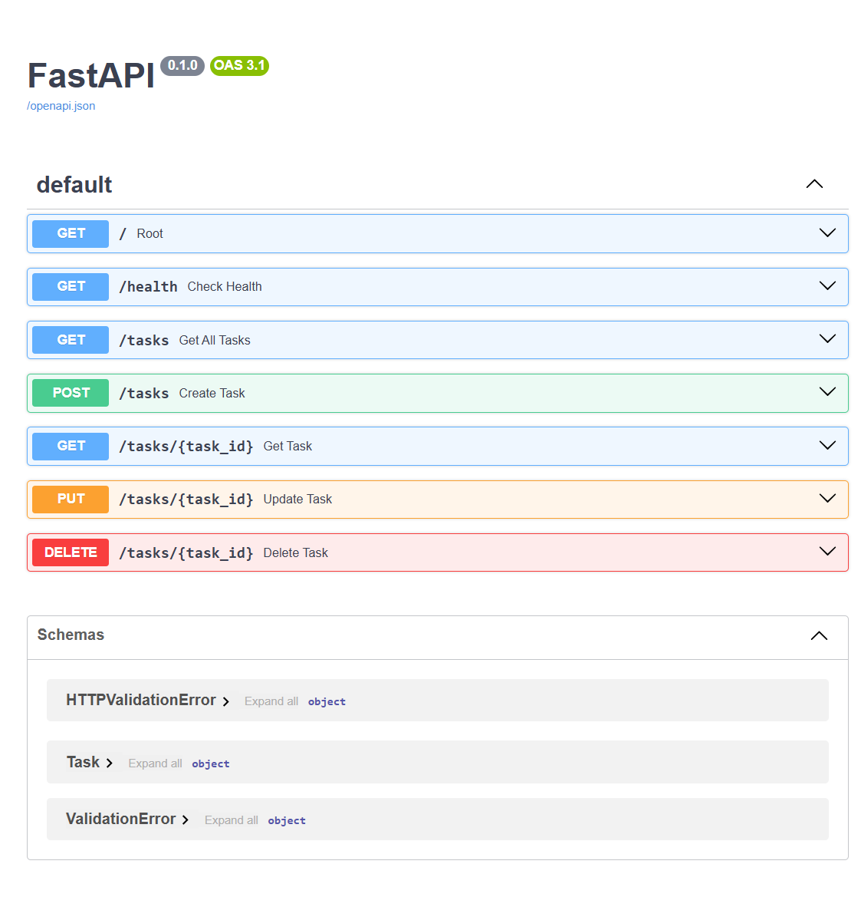

# FlyRank CRUD API

A small FastAPI CRUD service for tasks. It exposes a root endpoint with basic app info, a health check, and task endpoints for listing, reading, creating, updating, and deleting in-memory task records.

## Install

```bash
pip install -r requirements.txt
```

## Run

```bash
fastapi dev main.py
```

The API starts at `http://127.0.0.1:8000` and Swagger UI is available at `http://127.0.0.1:8000/docs`.

## Endpoints

| Method | Path | Description |
| --- | --- | --- |
| GET | `/` | Returns basic API metadata, including the app name, version, and a short endpoint list. |
| GET | `/health` | Returns a simple health status payload. |
| GET | `/tasks` | Returns all tasks currently stored in memory. |
| GET | `/tasks/{task_id}` | Returns one task by ID, or `404` if it does not exist. |
| POST | `/tasks` | Creates a new task from a JSON body with `title` and optional `done`. |
| PUT | `/tasks/{task_id}` | Updates an existing task by ID. |
| DELETE | `/tasks/{task_id}` | Deletes a task by ID and returns `204 No Content`. |

## Example `curl -i`

```bash
curl -i http://127.0.0.1:8000/tasks
```

```text
HTTP/1.1 200 OK
date: Thu, 16 Jul 2026 10:04:48 GMT
server: uvicorn
content-length: 115
content-type: application/json

[{"id":1,"title":"Hello","done":false},{"id":2,"title":"Task","done":true},{"id":3,"title":"Backend","done":false}]
```

## Swagger Screenshot



## 🤖 AI vs Me (Code Review & Comparison)

As part of Stage 7, I compared my custom implementation with the AI-generated reference version. This comparison highlights key design choices, minor oversights, and lessons learned about API contracts and in-memory data mutation in Python.

### My Prompt
> "Hi! I want you to build a simple To-Do list CRUD API using Python and FastAPI. Please write the entire code in a single file named `main.py` following these specifications:
> 1. Start with an in-memory list (database) containing 3 sample task objects pre-filled.
> 2. Implement the following endpoints: GET `/`, GET `/health`, GET `/tasks`, GET `/tasks/{id}`, POST `/tasks`, PUT `/tasks/{id}`, and DELETE `/tasks/{id}`.
> 3. Enforce validation on POST and PUT so that the title cannot be empty or contain only whitespace (returning a 400 Bad Request).
> 4. Ensure a successful DELETE returns a 204 No Content with an empty response body.
> 5. Add meaningful docstrings to all route functions for rich Swagger UI documentation."

### 1. What the AI Did Better & Lessons Learned
* **Input Isolation (Pydantic Schemas):** The AI used separate schemas for creation (`TaskCreate`) and updating (`TaskUpdate`). In my version, I used a single `Task` model that expected an `id` from the client. The AI's approach is much better because the client should never decide the `id` of a new resource; database/server-side auto-generation is the standard.
* **Deep Copying for Resets:** In my initial draft, I tried copying the state using `list(tasks)`. The AI pointed out a classic Python "shallow copy" trap: while the list itself was duplicated, the dictionary objects inside still pointed to the same memory addresses. The AI solved this cleanly using a deep-copy approach: `[item.copy() for item in INITIAL_TASKS]`.

### 2. Bugs & Oversights Identified in My Code
* **The Auto-Complete Trap:** I had an accidental `from turtle import title` import at the very top of my file—a classic VS Code auto-complete mistake! The AI caught this immediately. It wouldn't crash the server outright, but it is dead code that imports heavy built-in GUI libraries needlessly.
* **ID Validation in PUT:** In my original `PUT` endpoint, I checked if `item["id"] is None` during list iteration. Since our initial in-memory database items always have IDs, this check was redundant and theoretically unreachable.

### 3. What My Version Did Better
* **Leveraging FastAPI's Serialization (`response_model`):** In my `GET /tasks` endpoint, I explicitly defined `@app.get("/tasks", response_model=list[Task])`. This ensures that outgoing JSON payloads are strictly validated against our Pydantic schema before being sent to the client. The AI's version skipped this, returning raw dictionaries instead.
* **Inline Readability:** My list comprehension for the search and filtering logic (`[task for task in filtered_tasks if search.lower() in task["title"].lower()]`) was highly idiomatic, clean, and concise.

### 4. What Was Left Unspecified in the Prompt
* **State Management Strategy:** Because I didn't specify *how* the in-memory state should be declared globally, both implementations took slightly different paths. My version initially declared `tasks` and a backup list, while the AI used a dedicated `tasks_db` coupled with `INITIAL_TASKS` using `.copy()`. Explicitly stating data mutability rules in future prompts will yield more predictable results.

### 🔄 The Rematch (Second Iteration)
I revised my prompt to explicitly instruct the AI to use separate Pydantic models for request validation (without requiring an `id` field in the POST payload) and to enforce API serialization using FastAPI's `response_model` decorator.

**Outcome:** The regenerated AI code successfully implemented strict input-output isolation without crashing and matched my hand-written validation constraints perfectly.